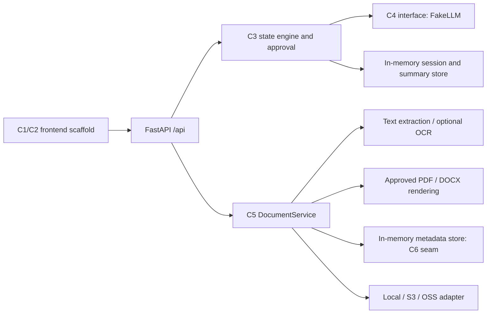

# Implementation specification

This document records the implemented local integration baseline and the C5/C7
interfaces. The [component plan](component-breakdown.md) proposes responsibilities
and extensions; it is not evidence that every proposed component is complete.
See [implementation status](implementation-status.md) for the wider team's work.

## 1. Purpose and boundaries

The application gathers patient-reported preparation information, validates and
tracks selected fields, and produces a summary for patient review. It does not
diagnose, prescribe, replace clinical judgement, or measure clinical safety from
field coverage. Development and demonstration use synthetic information.

C5 adds agreed engineering extensions: document upload/extraction, private object
storage, and PDF/DOCX rendering of the approved summary. Extraction supplies source
text, not medical interpretation or accepted patient facts. C7 supplies the shared
specification, configuration and reproducible local integration environment.

## 2. Implemented architecture

This is one FastAPI process, not seven microservices. Start with one worker on
loopback. Session metadata, summary approval and attachment metadata are currently
in-memory; object bytes persist independently. Database configuration is reserved
for C6 and does not currently activate a database or migration system.

| Area | Implemented role | Remaining collaboration |
|---|---|---|
| C1/C2 | API contracts for upload, review, approval and download | Frontend screens, identity-aware patient/clinician access |
| C3 | Intake routes, deterministic validation/planning, summary completion, hash-bound approval gate | Durable ownership/authentication and full revision workflow |
| C4 | Protocol plus deterministic offline FakeLLM | Real model adapter, evaluation and prompt work |
| C5 | Bounded extraction, storage abstraction, metadata seam, approved exports and routes | Integration of source evidence with C3/C4, live-account verification |
| C6 | Session and document protocols with in-memory development implementations | Database models/DAOs, transactions, migrations and durable audit/history |
| C7 | Setup/start/reset/smoke, environment reference, Docker option and inactive CI template | Maintainer enables workflow; keep shared docs current as components integrate |

## 3. Data and interfaces

`SessionState` remains the source of truth for consultation slots, transcript,
status and summary reference. C5 does not write its clinical slots. The approval
fields bind approval time and SHA-256 to the exact stored summary snapshot.
The summary API returns `content_sha256`, `approved` and `approved_at` alongside
sections, questions and model provenance.

`DocumentRecord` stores ID, owning session, filename, content type, byte length,
content SHA-256, backend/key, timestamp, processing status, extraction/error state,
and optional exported-summary reference/digest. Raw bytes stay in the selected
object store. Public provider URLs are not part of the contract.

`ExtractionResult` contains status (`processed`, `partial`, `ocr_required`), literal
chunks (`text`, one-based `location`, `method=text|ocr`) and warnings. Parsing
failure returns an error and retains failed metadata. Source pointers should
travel with excerpts if C3/C4 consumes them later.

Contracts and executable schemas are in:

- [HTTP API contract](api-contract.md) and FastAPI `/docs`.
- [C5 tool integration guide](c5-tools.md), including Python signatures/examples.
- `backend/app/core/models.py`, `backend/app/api/schemas.py` and
  `backend/app/utils/document_models.py`.
- `SessionStore`, `DocumentMetadataStore` and `ObjectStorage` protocols.

## 4. Workflows

### Intake, review and approved export

1. Create a session and use existing C3 message or slot-action endpoints.
2. Complete intake to create the current draft summary.
3. Retrieve the summary and display its sections/questions to the patient.
4. After explicit approval, send the returned `content_sha256` to the approval
   endpoint. A stale hash is rejected; the server uses its stored content.
5. Request PDF or DOCX export. C5 checks completion and current approval, renders
   literal stored content, and saves an export object with summary provenance.
6. Download through the session-scoped API. C2 must check `approved` before
   presenting the summary as a final handoff.

Changing the stored summary invalidates its prior approval. The existing C3
completed-session state does not yet support a complete edit/reopen experience.
The API gate enables that UI integration without implying that C1/C2 is finished.

### Attachments and evidence

1. Multipart-upload a supported source into an existing session.
2. Validate filename/type/size and save bytes plus metadata.
3. Explicitly request extraction and return bounded text with source locations.
4. Display warnings and partial/OCR-required status. Retain the original source.
5. C3/C4 may later consume evidence through their normal validation/review path;
   no automatic document-to-slot or document-to-LLM action is implemented.
6. Delete through the API while metadata exists; storage deletion precedes metadata
   deletion so provider failures can be retried.

## 5. File processing and storage decisions

Supported inputs are UTF-8 TXT, PDF, DOCX, PNG and JPEG; legacy DOC, macro-enabled
Word and encrypted PDFs are not supported. PDF text is page-addressed; DOCX body
paragraphs/tables retain order; image and text-free PDF pages can use optional
Tesseract OCR. Native text extraction cannot guarantee complete visual-document
coverage. OCR always requires review, even when processing succeeds.

Default limits: 10 MiB input/export, 50 PDF pages, 200,000 text characters,
20,000,000 image pixels and 20 seconds per OCR image/page. Additional DOCX ZIP
bounds and a hard 20 MiB upload ceiling apply. Parsing/OCR run synchronously;
there is no background job service or hard total CPU deadline for every parser.

Local files use the private configured root. AWS S3 and Alibaba OSS adapters are
optional, lazy-loaded SDK integrations. Objects remain private; download bytes are
proxied by the backend. Storage errors are normalized and secrets/provider error
internals are not sent in API messages. Download checks size and content hash.
See [storage configuration](storage-configuration.md) for exact settings and
account permissions.

PDF/DOCX rendering preserves supplied sections and questions and adds layout,
summary reference, session reference and page numbering. PDF font limitations
produce explicit errors rather than silent missing characters. C5 does not call an
LLM during rendering.

## 6. Access boundary and errors

Document, export, approval and document-health routes accept a shared bearer token
locally and require configuration of that token for cloud backends. Route handlers
check session existence; metadata lookup enforces the session/document relation.
This is an integration boundary, **not per-patient authentication**. The existing
session and GET-summary routes are still unauthenticated. Loopback binding and
synthetic data are required for the supplied local environment. Remote deployment
needs real identity, ownership rules, HTTPS and persistent storage design.

Errors follow the common `error.code`, `error.message`, `error.request_id` envelope.
404 means an unavailable resource; 409 indicates workflow/approval conflict;
413 indicates a size limit; 422 covers invalid/unsupported input or processing
failure; 503 covers unavailable or misconfigured storage/integrity failure. OCR
unavailability/timeouts can instead produce a 200 partial/OCR-required result with
warnings, preserving any successfully extracted text.

## 7. Environment and reset

`backend/.venv`, `backend/.env.example`, setup/start scripts and the local-only
Compose file make the environment repeatable. Dependencies are pinned at the
direct-package level; cloud SDKs and OCR Python dependencies have separate optional
requirements files. Default tests/smoke need no cloud account, database or live
model. Installation initially requires package downloads.

`ci/backend.yml` supplies a reviewable GitHub Actions template, not an active
workflow. The publishing credential lacks workflow-write permission. After merge,
a maintainer can copy it to `.github/workflows/backend.yml`, commit and publish
that change using the [activation instructions](setup.md#enable-github-actions-after-merge).
No remote CI run is claimed; local validation passed 225 tests and both offline
and actual HTTP smoke flows.

Restart clears all in-memory metadata. Local files or remote objects survive and
may become orphaned. The explicit `reset_dev_data.py --yes` utility deletes only
the default checkout-local objects directory after stopping the server; it never
acts on arbitrary configured paths or cloud buckets. C6 owns durable metadata,
transaction consistency and an eventual cleanup strategy. See [setup](setup.md).

## 8. Acceptance checks

| Capability | Acceptance evidence |
|---|---|
| Original intake flow remains available | Existing C3 unit/API tests pass |
| Upload and metadata | Allowed input round-trips; type/name/size validation and cross-session lookup tested |
| Extraction | Literal source text/locations; corrupt files rejected; bounded PDF/image/DOCX processing; OCR failure/status handling |
| Export gate | Incomplete/unapproved export rejected; stale approval rejected; approved PDF/DOCX downloadable |
| Storage | Local operations/integrity and fake cloud adapter contracts pass without real credentials |
| Integration environment | `scripts/smoke.py` exercises synthetic upload → extraction → intake → approval → both exports → deletion |
| Reset | No-confirmation invocation refuses deletion; fixed-path reset cannot target cloud/custom roots |
| CI template | Python 3.11/3.12 pytest plus offline smoke defined in `ci/backend.yml`; inactive until maintainer activation, no CI run claimed |

These checks establish the local implementation contract. They do not constitute
clinical validation, live cloud certification, completion of the proposal's wider
evaluation programme, or completion of C1/C2/C4/C6.
