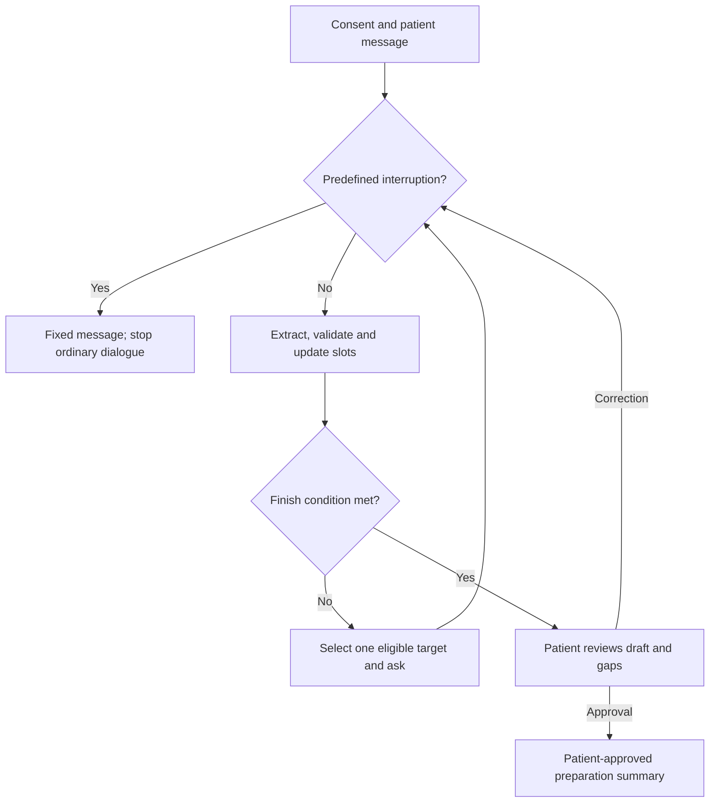

# Pre-consultation Preparation Agent
## 30 Typical Non-emergency Consultation Workflows

**Project:** ELEC5623, Group 9, The University of Sydney  
**Document version:** 1.0  
**Date:** 23 September 2026  
**Purpose:** A workflow catalogue for product design, question templates, schema configuration, synthetic case cards and demonstration planning.  
**Status:** Proposed implementation design for team review; not a clinically validated interview protocol.

**Contents:** [Purpose](#1-purpose-and-relationship-to-the-proposal) · [Workflow index](#2-catalogue-at-a-glance) · [Shared rules](#3-shared-dialogue-and-data-rules) · [30 templates](#4-the-30-workflow-templates) · [Leg-pain example](#5-worked-example-leg-pain-preparation) · [Implementation](#6-converting-the-catalogue-into-an-implementation) · [Evaluation](#7-evaluation-and-demonstration-use) · [Decisions](#8-decisions-to-record-before-freezing-the-schema) · [Sources](#9-source-notes)

## 1. Purpose and relationship to the proposal

The agent helps a patient organise information **before an already planned, non-emergency consultation**. Its output is a patient-reviewed account of the concern, relevant background, previous actions and questions for the clinician. This catalogue translates the supplied project proposal into 30 concrete examples of what the agent could ask and how it could adapt. The project boundary and hybrid architecture come from proposal Sections 3-5; the workflow choices and question wording below are new design proposals. See [Source notes](#9-source-notes).

The supplied image illustrates a useful interaction pattern: identify the concern, collect time and location, ask about the patient's experience and background, and finish with a preparation record. The image is used as structural inspiration; this document is not a word-for-word translation of its small Korean labels.

Here, a **workflow** is a reusable set of information targets, applicability rules, question templates and summary fields. It is not a diagnosis tree or a fixed questionnaire that every patient must finish. A patient who supplies five useful details in one sentence should not be asked for those details again.

The 30 workflows are representative design scenarios, chosen to exercise different kinds of preparation and dialogue behaviour. They are not a prevalence ranking, a claim of complete clinical coverage, or 30 independently validated clinical pathways. The catalogue covers symptom concerns, established-condition reviews, and planned results or preventive discussions. It does not label any particular patient's symptoms as non-emergency.

### 1.1 Product boundary

| The agent collects or organises | The clinician remains responsible for |
| --- | --- |
| Symptoms and experiences in the patient's own words | Diagnosis and differential diagnosis |
| Existing medicines, allergies and patient-reported history | Treatment choice and medication changes |
| Previous appointments, existing tests and what the patient was told | Interpreting results and ordering investigations |
| Questions, worries and goals for the booked consultation | Clinical assessment, urgency and care planning |
| Explicit uncertainty, omissions, corrections and consent | Determining what additional clinical information is needed |

The proposal's predefined safety/scope interruption runs before ordinary questioning and remains separate from these workflows. It uses project-approved fixed wording; this catalogue adds no symptom-specific urgency algorithm, risk score or emergency screening checklist. A workflow completion indicator must never mean that waiting for the appointment is safe. This follows proposal Sections 4.9 and 10.

**Proposed first implementation:** adult self-report, plain English and synthetic demonstration data. Paediatric, pregnancy-specific, caregiver/proxy and communication-assistance workflows would need their own reviewed schema adaptations. This is a suggested narrowing for implementation, not a restriction already stated in the proposal. Existing assistance needs can still be recorded voluntarily without collecting unnecessary identity details.

### 1.2 One explicit refinement to the proposal

Proposal Section 4.1 initially treats onset, duration, course, frequency, severity and functional impact as core presenting-concern fields. Section 4.4 also illustrates recurrence-dependent activation. The catalogue makes their applicability more explicit:

- **Every session:** reason for the visit, the patient's agenda, relevant medicines/allergies/history, and patient review/control.
- **A reported symptom concern:** the relevant symptom-history fields become applicable. Episode frequency and duration are refined only when the patient's account makes them relevant.
- **A results, prescription, established-condition or preventive review with no reported symptom concern:** symptom-specific fields remain `NOT_APPLICABLE`. They activate if the patient subsequently raises a symptom.

Record this refinement in the next schema version and review it with the team and tutor. It is a proposed change, not a claim that the uploaded proposal already specifies it. Freeze the same applicability rules for all evaluation baselines.

## 2. Catalogue at a glance

**Suggested first demonstration set:** WF-01, WF-05, WF-07, WF-08, WF-09, WF-14, WF-20, WF-27, WF-28 and WF-30. These ten exercise reusable pain/history modules, uncertainty, sensitive context, medicines, result grounding and multiple concerns. This prioritisation is an engineering recommendation; all 30 workflows are specified below.

| ID | Workflow | Main information pattern | Suggested stage |
| --- | --- | --- | --- |
| [WF-01](#wf-01-leg-pain) | Leg pain | Location, time, activity and effect on daily life | First demonstration |
| [WF-02](#wf-02-lower-back-discomfort) | Lower back discomfort | Location, pattern and movement context | Extension |
| [WF-03](#wf-03-neck-and-shoulder-discomfort) | Neck and shoulder discomfort | Site, activity context and functional limits | Extension |
| [WF-04](#wf-04-hand-wrist-or-arm-discomfort) | Hand, wrist or arm discomfort | Side, task-related pattern and function | Extension |
| [WF-05](#wf-05-recurring-headaches) | Recurring headaches | Episodes, frequency and impact | First demonstration |
| [WF-06](#wf-06-recurring-dizziness-discussed-at-a-planned-appointment) | Recurring dizziness | Patient's meaning, episodes and context | Extension |
| [WF-07](#wf-07-persistent-tiredness) | Persistent tiredness | Time course, usual activity and changes | First demonstration |
| [WF-08](#wf-08-sleep-difficulties) | Sleep difficulties | Sleep pattern and daytime effect | First demonstration |
| [WF-09](#wf-09-persistent-or-recurring-cough) | Persistent or recurring cough | Pattern, context and reported features | First demonstration |
| [WF-10](#wf-10-nasal-symptoms-and-patient-reported-allergy-concerns) | Nasal symptoms and allergy-related concerns | Patient-described symptoms and patterns | Extension |
| [WF-11](#wf-11-throat-discomfort-or-hoarseness) | Throat discomfort or hoarseness | Symptom distinction, time and voice/use impact | Extension |
| [WF-12](#wf-12-ear-discomfort-or-hearing-concerns) | Ear discomfort or hearing concerns | Side, experience and communication impact | Extension |
| [WF-13](#wf-13-eye-irritation-or-dryness) | Eye irritation or dryness | Side, experience and everyday context | Extension |
| [WF-14](#wf-14-recurrent-abdominal-discomfort) | Recurrent abdominal discomfort | Location, episodes and associated observations | First demonstration |
| [WF-15](#wf-15-heartburn-or-indigestion-concerns) | Heartburn or indigestion concerns | Patient's meaning and meal/time patterns | Extension |
| [WF-16](#wf-16-constipation) | Constipation | Change from usual bowel pattern and experience | Extension |
| [WF-17](#wf-17-recurrent-loose-stools) | Recurrent loose stools | Frequency, pattern and functional effect | Extension |
| [WF-18](#wf-18-urinary-symptoms-or-bladder-control-concerns) | Urinary symptoms or bladder-control concerns | Patient-selected concern and relevant details | Extension |
| [WF-19](#wf-19-menstrual-pattern-or-period-related-concerns) | Menstrual pattern or period-related concerns | Usual pattern, changes and impact | Extension |
| [WF-20](#wf-20-localised-rash-or-itching) | Localised rash or itching | Location, appearance in words and change | First demonstration |
| [WF-21](#wf-21-acne-or-ongoing-skin-treatment-review) | Acne or ongoing skin-treatment review | Patient-reported skin concerns and prior care | Extension |
| [WF-22](#wf-22-stress-or-anxiety-related-concerns) | Stress or anxiety-related concerns | Patient priorities and effect on daily life | Extension |
| [WF-23](#wf-23-low-mood-or-mental-health-follow-up) | Low mood or mental-health follow-up | Patient experience, change and support | Extension |
| [WF-24](#wf-24-established-high-blood-pressure-review) | Established high blood pressure review | Existing records, medicines and questions | Extension |
| [WF-25](#wf-25-established-diabetes-review) | Established diabetes review | Existing records, current care and questions | Extension |
| [WF-26](#wf-26-established-asthma-review) | Established asthma review | Patient-reported changes and existing care | Extension |
| [WF-27](#wf-27-medication-review-or-repeat-prescription-discussion) | Medication review or repeat-prescription discussion | What is taken, practical concerns and goals | First demonstration |
| [WF-28](#wf-28-existing-test-results-follow-up) | Existing test-results follow-up | Test identity, source wording and questions | First demonstration |
| [WF-29](#wf-29-planned-preventive-health-or-screening-discussion) | Planned preventive-health or screening discussion | Booked purpose, existing history and preferences | Extension |
| [WF-30](#wf-30-preparing-an-appointment-with-multiple-concerns) | Preparing an appointment with multiple concerns | Patient-selected agenda and separate concern records | First demonstration |

## 3. Shared dialogue and data rules

### 3.1 Common session flow

1. Explain the preparation purpose and obtain consent. Let the patient write freely about the planned appointment.
2. Run the predefined scope/safety interruption on every new patient message, including corrections. If the message is not interrupted, extract supported facts, including facts that answer questions not yet asked.
3. Select a workflow from explicit patient information or a patient-selected label. If ambiguous, ask a neutral clarification. A workflow label is not a diagnosis.
4. Merge validated facts into the structured state. Apply deterministic conditional-field rules.
5. Choose the next applicable, unresolved information target. Ask one neutral question about that target. Offer **I don't know**, **Prefer not to answer**, **Correct something**, and **Finish and review**.
6. Stop when the proposal's stopping policy applies. Produce a grounded draft with uncertainty and gaps visible.
7. Let the patient correct, remove and approve the summary and their clinician questions before showing the read-only handoff view.



The return from **ask** to the interruption gate means that the patient's next message is checked before processing. During review, retain the review mode and the patient's finish choice: an accepted correction regenerates the draft for review rather than silently restarting ordinary questioning. Withdrawal of consent ends processing without generating a new handoff. A safety interruption must not fall through to an ordinary completion screen.

### 3.2 Shared question modules

These are original candidate templates. Their broad preparation purpose is consistent with NHS guidance to record symptoms, medicines and important questions, and AHRQ's question-preparation approach. These sources support the general content categories, not validation of our individual rules. [NHS appointment preparation](https://www.nhs.uk/nhs-services/gps/what-to-ask-your-doctor/), [AHRQ Question Builder](https://www.ahrq.gov/sites/default/files/wysiwyg/patient-safety/questionbuilder-flyer.pdf).

| Target | Candidate patient-facing question | When applicable |
| --- | --- | --- |
| `main_concern` | What would you like to prepare for your appointment? | Every session |
| `symptom_onset` | When did you first notice this? | Reported symptom concern |
| `symptom_course` | How has it changed since you first noticed it? | Reported symptom concern |
| `symptom_pattern` | Is it present all the time, or does it come and go? | Reported symptom concern; activates episode fields if appropriate |
| `symptom_frequency` | How often does it happen? | Repeated/intermittent symptom reported |
| `severity` | How strong or troublesome does it feel to you? | Reported symptom; accept plain words |
| `functional_impact` | How does it affect your usual activities? | Reported symptom or other stated daily-life effect |
| `current_medications` | What medicines or supplements do you currently use? | Every session; ask once |
| `allergies` | What allergies or past medicine reactions would you like recorded? | Every session; ask once |
| `relevant_history` | What medical history would you like the clinician to know? | Every session; voluntary |
| `previous_actions` | What have you already tried for this concern? | Current symptom/management concern; response activates details |
| `previous_consultation.exists` | Have you discussed this concern with a healthcare professional before? | A concern for which prior assessment is relevant |
| `previous_tests` | What tests have already been done for this concern, if any? | Prior investigation/assessment explicitly reported |
| `patient_worry` | What concerns you most about this? | Every session; accept no particular worry |
| `appointment_goal` | What would you most like to get from the appointment? | Every session |
| `clinician_questions` | What would you like to ask the clinician? | Every session; retain the patient's wording |

Ask missing facts only. Do not derive duration by silently converting an approximate onset into an exact date. Reuse the onset evidence when it already answers the intended duration field; otherwise separate **time since first onset** from **length of each episode**.

An answer may fill several slots even though the question has one target. Ask medicine name, dose and frequency as separate follow-ups only after medicine use is reported and only if those details are missing. Record patient-reported benefit or suspected adverse effects without attributing causation.

### 3.3 State, applicability and scope

| State | Meaning | Required behaviour |
| --- | --- | --- |
| `FILLED` | Supported value or explicit negative answer | Do not re-ask unless corrected or contradicted |
| `MISSING` | Applicable but no usable answer | Eligible for questioning within the turn budget |
| `UNCERTAIN` | Unknown, approximate/unclear in a material way, or conflicting | Preserve uncertainty; at most the permitted high-importance clarification |
| `SKIPPED` | Patient explicitly declines | Do not re-ask or hide the refusal |
| `NOT_APPLICABLE` | The schema's activation condition is not met | Exclude from coverage denominator; never treat as a negative finding |

Approximate information may still be `FILLED` when the schema permits it, such as "about three weeks". `UNCERTAIN` is appropriate when the requested value remains unknown or unresolved; it is not a penalty for ordinary patient language. The backend sets states after validation, never the LLM directly.

**A blank is not "no".** "No medicines" and "no known allergies" can be `FILLED` patient-reported answers. A question never asked remains `MISSING` when applicable. Lack of a report does not establish absence of a symptom, a condition or a safety issue.

Availability is a value, not a sixth slot state. If the target is whether a record is available, "I have no records available" can fill that availability field; dependent record-detail fields remain inapplicable. If the patient reports an existing record but cannot recall its value, that value is `UNCERTAIN`. Do not collapse record availability, record contents and confidence into one field.

Use session-level slots for shared medicines/allergies/context and concern-level slots for time, location and impact. A fully qualified key can be `session.allergies` or `concerns.c01.symptom_onset`. Workflow-local slot names in Section 4 are design identifiers to register in the versioned dictionary, not a complete production schema. Never merge identical field names across different concerns.

Store states on askable leaf fields. A filled medicine/test/history list does not fill all item details. For example, `previous_consultation.exists`, `.date`, `.reviewing_clinician` and `.reported_explanation` are separate targets; detail targets activate only after a prior consultation is explicitly reported. A bare container reference in a workflow denotes its inventory question or record link, not a claim that every child field is known. The same principle applies to medication names, doses and frequencies.

### 3.4 Stopping and coverage

The normal dialogue stops when there are no eligible missing targets or permitted clarifications, the configured turn cap is reached, or the patient chooses to finish. Consent withdrawal and the predefined interruption also stop ordinary processing, with their own outcomes. These rules follow proposal Section 4.7.

Do not require a patient to answer every field before review. Every workflow below inherits this rule; a local completion note does not require immediate termination before remaining shared fields are considered. Conversely, local fields must not force continued questioning after the patient finishes.

Keep **information coverage** separate from **resolution**. Only `FILLED` applicable fields count as supplied information. `UNCERTAIN` and `SKIPPED` may count as resolved for dialogue purposes, but not as supplied facts. Exclude `NOT_APPLICABLE` from both denominators. An 80% or 90% threshold is an evaluation milestone in the proposal, not an automatic stopping rule or medical assurance.

### 3.5 How to read each workflow

- An opening is fictional and demonstrates route selection; facts in it are already known.
- The table is a **question bank in an illustrative order**. The deterministic planner may reorder eligible targets using the proposal's frozen priority policy.
- A question can be asked only after its workflow and field are applicable. Wording such as "the medicine" or "these episodes" requires an explicit antecedent in the patient's account.
- Conditional branches collect additional description; they do not infer causes, recommend actions or evaluate urgency.
- Each optional clinician question is a draft for the patient to accept or edit. It must not be silently attributed to the patient.
- Tailor question drafts to supported facts. A voice-specific question applies only to a reported voice concern; a question about activity limits applies only when the patient reports those limits. Otherwise ask what the patient wants to discuss.
- Sensitive-topic permission is a separate control: ask whether the patient wants to include optional personal detail, and stop that module if they decline. Mark explicit refusals `SKIPPED`. Withdrawing permission for one topic does not withdraw consent for the whole session; withdrawing session consent ends processing.

## 4. The 30 workflow templates

### WF-01 Leg pain

**Synthetic opening:** "My left leg has been aching for three weeks. I want to explain it clearly at my booked GP appointment."

**Applicability:** Activate after an explicit report of leg pain or the patient's selection of this topic. The opening already fills `symptom_duration`, the reported side and the patient's preparation context. Preserve "aching" as the patient's description.

**Ordered question bank - ask only missing targets.** The backend selects one applicable target at a time; these are candidate questions, not a compulsory questionnaire.

| Order | Slot ID | Plain-language question |
| --- | --- | --- |
| 1 | `leg.pain_site` | Where in your leg do you feel the pain? |
| 2 | `leg.pain_character` | How would you describe the pain in your own words? |
| 3 | `symptom_frequency` | How often do you notice the pain? |
| 4 | `leg.activity_context` | What are you usually doing when you notice it? |
| 5 | `leg.change_factors` | What have you noticed changes the pain? |
| 6 | `functional_impact` | How does the pain affect your everyday activities? |
| 7 | `appointment_goal` | What would you most like to discuss at your appointment? |

**Deterministic adaptation:** If the patient explicitly reports an injury, activate `leg.reported_event` and ask "What happened when you injured your leg?" If the patient reports pain travelling elsewhere, activate `leg.pain_spread` and ask "Where does the pain travel?" Otherwise those targets remain inactive. Facts already supplied resolve their targets without another question.

**Summary focus:** Preserve location, timeline, the patient's description, observed activity relationships and practical impact. Record an injury as reported history, without asserting causation. Draft for patient approval: "Could we discuss how this leg pain is affecting my usual activities?"

**Stop/uncertainty example:** If the patient cannot pinpoint the area, retain "left leg; exact area uncertain" and advance. Do not repeatedly ask the patient to choose an anatomical label. Complete the shared agenda and review when the applicable queue is resolved.

**Source context:** Patient-prepared questions and medicine lists are supported by [Healthdirect - Question Builder](https://www.healthdirect.gov.au/question-builder); the branching above is a proposed design.

### WF-02 Lower back discomfort

**Synthetic opening:** "My lower back keeps bothering me after long days at my desk. I have an appointment next week."

**Applicability:** Activate from explicitly reported lower back discomfort or patient selection. Preserve desk work as a reported association; it does not establish the cause. The opening already provides the broad location and recurring course.

**Ordered question bank - ask only missing targets.** Other shared history targets are inherited and must not be duplicated under a back-specific name.

| Order | Slot ID | Plain-language question |
| --- | --- | --- |
| 1 | `back.pain_site` | Where in your lower back is the discomfort? |
| 2 | `symptom_onset` | When did you first notice this problem? |
| 3 | `back.pain_character` | What does the discomfort feel like? |
| 4 | `symptom_frequency` | How often does it bother you? |
| 5 | `back.change_factors` | What have you noticed changes the discomfort? |
| 6 | `functional_impact` | How does the discomfort affect your daily routine? |
| 7 | `previous_actions` | What have you already tried for this problem? |

**Deterministic adaptation:** If the patient explicitly reports lifting or another event around onset, activate `back.reported_event` and ask "What happened around the time the discomfort began?" If they report pain spreading, activate `back.pain_spread` and ask "Where does it spread?" If they report a previous appointment, use `previous_consultation.reported_explanation` to capture what they recall being told. Do not create an inferred diagnosis from that recollection.

**Summary focus:** Organise the timeline, usual pattern, activities affected, patient-observed changes and previous actions. Draft for patient approval: "Could we discuss the back discomfort that is interfering with my usual routine?" Record any requested treatment discussion as the patient's agenda, without proposing treatment.

**Stop/uncertainty example:** "I cannot remember when it first started" resolves onset as unknown. A volunteered approximate period can be preserved, but an exact date is unnecessary. Shared review can proceed with that limitation visible.

**Source context:** Daily function is a relevant pain-history domain in [Healthdirect - Chronic pain](https://www.healthdirect.gov.au/chronic-pain). This does not classify this example as chronic pain.

### WF-03 Neck and shoulder discomfort

**Synthetic opening:** "My neck and shoulders feel stiff by the end of the day. I would like to bring some organised notes to my GP."

**Applicability:** Activate for explicitly described neck or shoulder discomfort, including patient-described stiffness. Record the reported end-of-day pattern and both named areas. Do not assume desk posture, muscle strain or a connection between separate areas.

**Ordered question bank - ask only missing targets.** Shared onset, duration, severity and agenda targets remain available without creating duplicate fields.

| Order | Slot ID | Plain-language question |
| --- | --- | --- |
| 1 | `neck_shoulder.main_site` | Which area bothers you most? |
| 2 | `symptom_onset` | When did you first notice the discomfort? |
| 3 | `neck_shoulder.character` | How would you describe the discomfort? |
| 4 | `symptom_frequency` | How often do you experience it? |
| 5 | `neck_shoulder.movement_context` | Which movements seem to change it? |
| 6 | `functional_impact` | How does the discomfort affect everyday tasks? |
| 7 | `previous_actions` | What have you already tried? |

**Deterministic adaptation:** If the patient explicitly says turning their head affects the discomfort, activate `neck_shoulder.turning_detail` and ask "What do you notice when you turn your head?" If they report a shoulder-specific task, activate `neck_shoulder.task_detail` and ask "What happens during that task?" Activate these follow-ups only when the target detail is still missing. If the patient explicitly describes two unrelated concerns, retain two concern records and ask which they want to prepare first.

**Summary focus:** Keep the patient's distinction between neck and shoulder experiences, the time pattern, movement observations and practical restrictions. Draft for patient approval: "Could we discuss how my neck and shoulder discomfort is affecting my daily tasks?"

**Stop/uncertainty example:** Accept "the whole area" when the patient cannot distinguish the sites. Do not require self-examination, range-of-motion testing or a named structure before producing a draft summary.

**Source context:** Function and sleep are recognised pain-impact domains in [Healthdirect - Chronic pain](https://www.healthdirect.gov.au/chronic-pain); this template applies no chronic-pain classification.

### WF-04 Hand, wrist or arm discomfort

**Synthetic opening:** "My right wrist hurts when I use the computer, and I want to discuss it at my planned appointment."

**Applicability:** Activate after an explicit report or selection of hand, wrist or arm discomfort. Extract the right wrist and computer-use association immediately. Do not infer a repetitive strain injury, nerve problem or work-related diagnosis.

**Ordered question bank - ask only missing targets.** The site question is already resolved in the synthetic opening and would be skipped there.

| Order | Slot ID | Plain-language question |
| --- | --- | --- |
| 1 | `upper_limb.pain_site` | Where do you feel the discomfort? |
| 2 | `symptom_onset` | When did you first notice it? |
| 3 | `upper_limb.character` | What does the discomfort feel like? |
| 4 | `symptom_frequency` | How often do you notice it? |
| 5 | `upper_limb.task_context` | Which task makes the discomfort most noticeable? |
| 6 | `functional_impact` | What have you had to change in your daily activities? |
| 7 | `previous_actions` | What have you already tried for it? |

**Deterministic adaptation:** If the patient explicitly reports an injury, activate `upper_limb.reported_event` and ask "What happened when you injured the area?" If they describe a particular grip or hand task, activate `upper_limb.task_detail` and ask "What happens when you do that task?" If they mention using a support or brace, capture the item and their reported experience through `previous_actions`, without endorsing it or evaluating effectiveness clinically.

**Summary focus:** Capture the affected area, time course, patient-observed task association, activity changes and previous actions. Retain phrases such as "I think typing contributes" as attributed beliefs. Draft for patient approval: "Could we discuss the wrist discomfort that is making computer work difficult?"

**Stop/uncertainty example:** If "computer work" is the fullest description the patient can provide, preserve it. Do not loop through keyboard, mouse and grip questions merely to fill optional task detail.

**Source context:** Preparing a concise question agenda follows [Healthdirect - Question Builder](https://www.healthdirect.gov.au/question-builder). Exact slots and branches are proposed implementation choices.

### WF-05 Recurring headaches

**Synthetic opening:** "I get headaches several times a month and have booked an appointment to talk about them."

**Applicability:** Activate when the patient explicitly reports recurring headaches or chooses this topic. Preserve "several times a month" in `symptom_frequency`; do not insist on an exact count. A headache label does not activate a migraine diagnosis.

**Ordered question bank - ask only missing targets.** The shared core captures overall onset and course; `headache.episode_length` describes one episode rather than the duration of the whole concern.

| Order | Slot ID | Plain-language question |
| --- | --- | --- |
| 1 | `headache.pain_site` | Where do you usually feel the headache? |
| 2 | `headache.character` | What does the headache feel like? |
| 3 | `headache.episode_length` | How long does a usual headache last? |
| 4 | `headache.observed_context` | What patterns have you noticed around your headaches? |
| 5 | `functional_impact` | How do the headaches affect your usual activities? |
| 6 | `previous_actions` | What have you already tried when a headache occurs? |
| 7 | `appointment_goal` | What would you most like to discuss about the headaches? |

**Deterministic adaptation:** If the patient reports keeping a diary, activate `headache.diary_details` and ask "Which diary details would you like included?" If they explicitly report another experience during episodes, activate `headache.reported_association` and ask "How does that experience relate in time to the headache?" If medicine use is reported, resolve missing details within shared `current_medications`; do not calculate an overuse classification.

**Summary focus:** Present the reported episode pattern, impact, volunteered associated experiences and actions already taken. Draft for patient approval: "Could we discuss the pattern of these headaches and their effect on my daily life?"

**Stop/uncertainty example:** If episode lengths vary, record the range or "varies; not tracked." An existing diary is optional; the agent must not require new monitoring before completing preparation.

**Source context:** Timing, duration and medicine records are example diary fields in [St George's NHS - Monthly headache diary](https://www.stgeorges.nhs.uk/wp-content/uploads/2014/11/SGH-Monthly-Headache-Diary.pdf).

### WF-06 Recurring dizziness discussed at a planned appointment

**Synthetic opening:** "I have had occasional dizzy spells for a while. I have already arranged a GP appointment and want help describing them."

**Applicability:** Activate from explicitly reported recurring dizziness within the established planned-consultation context. Keep "for a while" as imprecise history until the patient offers a clearer estimate. This topic selection does not establish that symptoms are safe to wait with.

**Ordered question bank - ask only missing targets.** The patient may describe the sensation without adopting clinical terminology.

| Order | Slot ID | Plain-language question |
| --- | --- | --- |
| 1 | `dizziness.description` | What does "dizzy" feel like to you? |
| 2 | `symptom_onset` | When did you first notice these episodes? |
| 3 | `symptom_frequency` | How often do the episodes happen? |
| 4 | `dizziness.episode_length` | How long does an episode usually last? |
| 5 | `dizziness.episode_context` | What are you usually doing when an episode happens? |
| 6 | `functional_impact` | How do the episodes affect your usual activities? |
| 7 | `appointment_goal` | What would you most like your clinician to understand? |

**Deterministic adaptation:** If the patient explicitly links episodes to changing position, activate `dizziness.position_detail` and ask "Which change of position have you noticed before an episode?" If they report a recent medicine change, capture the reported change within `current_medications`, preserving temporal association without attribution. The backend must run the document's global safety interrupt before selecting any further target.

**Summary focus:** Retain the patient's sensation words, episode timing, circumstances, functional impact and main concern. Draft for patient approval: "Could we discuss these recurring dizzy spells and how to describe them more clearly?"

**Stop/uncertainty example:** If the patient cannot distinguish spinning from light-headedness, keep their original wording. Do not force a subtype or use a subtype to calculate urgency. Stop when preparation is complete, the user finishes, or the global interrupt applies.

**Source context:** Different everyday descriptions of dizziness are illustrated by [NHS - Dizziness](https://www.nhs.uk/symptoms/dizziness/); its diagnosis and care pathways are not implemented here.

### WF-07 Persistent tiredness

**Synthetic opening:** "I have felt unusually tired for the last month. I want to make sure I explain the changes at my appointment."

**Applicability:** Activate when the patient explicitly reports persistent tiredness or chooses this concern. Extract the approximate one-month duration. Do not equate tiredness with a specific condition, including a sleep disorder, anaemia or a mental health diagnosis.

**Ordered question bank - ask only missing targets.** The shared core separately covers medicines, relevant history and the patient's worries.

| Order | Slot ID | Plain-language question |
| --- | --- | --- |
| 1 | `fatigue.description` | What does feeling tired mean for you? |
| 2 | `symptom_course` | How has the tiredness changed since it began? |
| 3 | `fatigue.daily_pattern` | When during the day do you notice it most? |
| 4 | `fatigue.rest_experience` | What do you notice after resting? |
| 5 | `fatigue.sleep_description` | How would you describe your sleep recently? |
| 6 | `functional_impact` | Which usual activity has become hardest to manage? |
| 7 | `appointment_goal` | What would you most like to discuss about the tiredness? |

**Deterministic adaptation:** If the patient explicitly reports difficulty sleeping and chooses to explore it, offer WF-08 and reuse existing sleep facts. If they report an illness around onset, activate `fatigue.reported_illness_timeline` and ask "When did that illness occur compared with the tiredness?" If they describe a changed work or caring schedule, activate `fatigue.routine_change` and ask "What changed in your routine?" None of these associations establishes a cause.

**Summary focus:** Explain the patient's experience, changes from their usual baseline, daily pattern, rest and sleep observations, and functional impact. Draft for patient approval: "Could we discuss the tiredness that is affecting my usual activities?"

**Stop/uncertainty example:** "I do not know whether rest helps" is a valid unknown. Do not suggest an activity experiment, require a sleep tracker, or prolong the conversation to obtain a pattern.

**Source context:** These history domains are informed by [Healthdirect - Fatigue](https://www.healthdirect.gov.au/fatigue), particularly its description of questions a clinician may ask.

### WF-08 Sleep difficulties

**Synthetic opening:** "For the last few months I have been waking during the night. I would like to prepare for my GP appointment."

**Applicability:** Activate after an explicit sleep concern or patient selection. Extract the reported night waking and approximate duration; do not label the patient as having insomnia or infer its cause. Sleep information already captured in WF-07 is reused with its evidence.

**Ordered question bank - ask only missing targets.** The first question is skipped when the patient's main sleep difficulty is already clear.

| Order | Slot ID | Plain-language question |
| --- | --- | --- |
| 1 | `sleep.main_difficulty` | What part of sleeping is most difficult for you? |
| 2 | `symptom_frequency` | How many nights are affected in a usual week? |
| 3 | `sleep.usual_bedtime` | What time do you usually go to bed? |
| 4 | `sleep.usual_wake_time` | What time do you usually get up? |
| 5 | `sleep.observed_context` | What patterns have you noticed around the difficult nights? |
| 6 | `functional_impact` | How does the sleep difficulty affect your day? |
| 7 | `previous_actions` | What have you already tried for your sleep? |

**Deterministic adaptation:** If night waking is reported, activate `sleep.waking_duration` and ask "About how long are you awake during those episodes?" If the patient reports shift work, activate `sleep.shift_pattern` and ask "How does your work schedule vary?" If they volunteer an observation made by someone else, activate `sleep.reported_observation` and ask "What did that person notice?" Attribute the observation to its source.

**Summary focus:** Present the reported difficulty, pattern, schedule, daytime impact and previous actions. Draft for patient approval: "Could we discuss my sleep pattern and its effect on how I feel during the day?"

**Stop/uncertainty example:** Accept "my schedule varies" without constructing a falsely precise weekly average. The patient can skip schedule details and still review a useful summary. Do not score sleep quality or recommend sleep routines.

**Source context:** Sleep difficulties and daytime effects are described in [NHS - Insomnia](https://www.nhs.uk/conditions/insomnia/); the diagnostic label and treatment guidance are outside this template.

### WF-09 Persistent or recurring cough

**Synthetic opening:** "This cough keeps coming back, and I have booked an appointment to discuss it."

**Applicability:** Activate from an explicitly described persistent or recurring cough or patient selection. Preserve the reported recurring course. The template does not use cough duration, sound or mucus descriptions to decide a diagnosis or waiting time.

**Ordered question bank - ask only missing targets.** Shared medicines, relevant history and prior consultation details are inherited rather than duplicated.

| Order | Slot ID | Plain-language question |
| --- | --- | --- |
| 1 | `symptom_onset` | When did you first notice this cough? |
| 2 | `cough.description` | How would you describe the cough? |
| 3 | `symptom_frequency` | How often are you coughing? |
| 4 | `cough.daily_pattern` | When during the day is the cough most noticeable? |
| 5 | `cough.observed_context` | What situations seem to bring on the cough? |
| 6 | `functional_impact` | What does the cough interrupt in your daily life? |
| 7 | `previous_actions` | What have you already tried for the cough? |

**Deterministic adaptation:** If the patient explicitly reports bringing up mucus, activate `cough.reported_mucus` and ask "How would you describe the mucus you have noticed?" If they report exposure to smoke, vaping or workplace dust, activate `cough.reported_exposure` and ask "What exposure would you like recorded for your clinician?" If sleep interruption is reported, capture it in `functional_impact`; do not automatically start a separate sleep workflow. The global interrupt always precedes further questioning.

**Summary focus:** Record the cough's timeline, patient description, pattern, reported exposures, disruption and previous actions. Draft for patient approval: "Could we discuss the recurring cough and the situations in which I notice it most?"

**Stop/uncertainty example:** A patient who has not observed mucus details may answer unknown. Do not require inspection, colour matching or another coughing episode to finish preparation. A report of "dry" leaves mucus-detail targets inactive.

**Source context:** Descriptions of cough and its daily impact are informed by [Healthdirect - Cough](https://www.healthdirect.gov.au/cough), without importing its treatment or urgency advice.

### WF-10 Nasal symptoms and patient-reported allergy concerns

**Synthetic opening:** "My nose is often blocked in the mornings. I wonder whether allergies are involved, and I have a GP appointment booked."

**Applicability:** Activate for explicitly reported nasal symptoms or a patient-selected allergy concern. Extract morning timing and record the allergy idea under `patient_worry` as the patient's belief. Do not populate `allergies` as a confirmed condition from that speculation.

**Ordered question bank - ask only missing targets.** A general symptom description invites the patient's own account without presenting a symptom checklist.

| Order | Slot ID | Plain-language question |
| --- | --- | --- |
| 1 | `nasal.main_description` | What nasal symptoms are bothering you most? |
| 2 | `symptom_onset` | When did you first notice this problem? |
| 3 | `symptom_frequency` | How often do the symptoms occur? |
| 4 | `nasal.time_pattern` | What pattern have you noticed over time? |
| 5 | `nasal.environment_context` | Where do you most often notice the symptoms? |
| 6 | `functional_impact` | How do the symptoms affect your usual activities? |
| 7 | `previous_actions` | What have you already tried for them? |

**Deterministic adaptation:** If the patient explicitly reports a seasonal pattern, activate `nasal.season_detail` and ask "Which times of year have you noticed this?" If they report a particular place or exposure, activate `nasal.exposure_detail` and ask "What do you notice when you are in that situation?" If they report a previously diagnosed allergy, use shared `allergies` and `relevant_history` to record the reported diagnosis and source; do not reinterpret a suspected trigger as confirmation.

**Summary focus:** Present nasal symptoms, timeline, patient-observed environmental patterns, daily impact and the patient's allergy question. Draft for patient approval: "Could we discuss my nasal symptoms and my question about whether allergies might be involved?"

**Stop/uncertainty example:** If the patient cannot identify a trigger, preserve that uncertainty. Do not cycle through pollen, pets, dust and food suggestions or ask them to test an exposure.

**Source context:** Timing, environment and daily impact appear in [Healthdirect - Hay fever](https://www.healthdirect.gov.au/hay-fever). This source informs history topics only; it does not establish an allergy for the patient.

### WF-11 Throat discomfort or hoarseness

**Synthetic opening:** "My voice has sounded rough for about three weeks, especially after long video calls."

**Applicability:** Activate after explicit reporting or selection of throat discomfort or a voice concern. Do not assume both occur together. The opening supplies duration, voice change, and speaking context; extract those facts before selecting a question.

| Order | Question target | One question, if missing and applicable |
|---|---|---|
| 1 | `throat_focus` | Which throat or voice concern would you most like to describe? |
| 2 | `symptom_onset` | When did you first notice this? |
| 3 | `symptom_course` | How has it changed since it first started? |
| 4 | `throat_sensation` | How would you describe the feeling in your throat? |
| 5 | `voice_change_description` | How does your voice sound different from usual? |
| 6 | `voice_use_context` | During which speaking activities do you notice the change? |
| 7 | `functional_impact` | How does this affect your everyday activities? |

**Deterministic branches:**

- Explicit voice change activates `voice_change_description` and `voice_use_context`; discomfort alone does not.
- Explicit throat discomfort activates `throat_sensation`. If both concerns are reported, retain both and use the patient's stated priority to order the applicable targets.
- An explicit account of an earlier appointment links to the existing `previous_consultation` record; it does not start a second medical-history interview.

**Summary focus:** Preserve the patient's description, approximate timeline, reported speaking context, and impact. Label their proposed explanation as their belief, if they offered one; never convert it into a cause.

**Optional clinician question, add only after patient approval:** "How can we address the effect this is having on my voice use?"

**Stop/skip/uncertainty:** Accept everyday descriptions such as "rough" or "scratchy." An onset can remain unknown or approximate; do not require an exact date or specialist terminology before review.

**Source context:** [NHS appointment preparation](https://www.nhs.uk/nhs-services/gps/what-to-ask-your-doctor/); symptom-specific targets are proposed designs.

### WF-12 Ear discomfort or hearing concerns

**Synthetic opening:** "I have trouble following conversations at family meals, and I want to explain it properly at my appointment."

**Applicability:** Activate after an explicit ear-discomfort or hearing-concern report. Do not infer hearing loss from age or communication preferences. The patient's description determines whether discomfort or hearing-context questions apply.

| Order | Question target | One question, if missing and applicable |
|---|---|---|
| 1 | `ear_focus` | Which ear or hearing concern would you most like to describe? |
| 2 | `ear_side` | Which ear seems affected? |
| 3 | `symptom_onset` | When did you first notice this? |
| 4 | `symptom_course` | How has it changed over time? |
| 5 | `ear_discomfort_description` | How would you describe the discomfort? |
| 6 | `hearing_context` | In which situations is hearing most difficult for you? |
| 7 | `functional_impact` | How does this affect your everyday life? |

**Deterministic branches:**

- Reported discomfort activates `ear_discomfort_description`; a hearing concern activates `hearing_context`. Both may apply when both are explicitly reported.
- "Both ears" completes `ear_side`; "I cannot tell" stores unknown. Neither response triggers a comparison test or a request to test each ear.
- An explicitly reported existing hearing aid is linked to `relevant_history`; an earlier hearing assessment is linked to `previous_tests`. Do not infer a diagnosis from either fact.

**Summary focus:** Separate observations from reported established diagnoses. Include laterality, timeline, listening situations, and communication impact. Preserve accessible-communication requests in the shared appointment-preference record.

**Optional clinician question, add only after patient approval:** "How can we address the difficulties I am having with everyday conversations?"

**Stop/skip/uncertainty:** No home hearing test, loudness comparison, or device adjustment is requested. Unclear laterality or absent test records does not prevent a useful preparation summary; retain the gap for review.

**Source context:** [NHS appointment preparation](https://www.nhs.uk/nhs-services/gps/what-to-ask-your-doctor/); ear-specific targets are proposed designs.

### WF-13 Eye irritation or dryness

**Synthetic opening:** "My eyes often feel gritty after I work at my computer."

**Applicability:** Activate after explicit reporting or selection of irritation or dryness. "Gritty" remains a patient description. Record the computer-work association without claiming that screen use caused the symptom.

| Order | Question target | One question, if missing and applicable |
|---|---|---|
| 1 | `eye_side` | Which eye is affected? |
| 2 | `symptom_onset` | When did you first notice this? |
| 3 | `eye_sensation` | How would you describe the feeling in your eye? |
| 4 | `symptom_frequency` | How often does it happen? |
| 5 | `eye_context` | In what situations do you notice it most? |
| 6 | `eye_lens_context` | How does it vary while you are wearing your contact lenses? |
| 7 | `functional_impact` | How does this affect your everyday activities? |

**Deterministic branches:**

- `eye_lens_context` applies only after explicit contact-lens use; eyesight concerns or glasses do not activate it.
- A context already supplied in the opening completes `eye_context`; the agent does not ask the patient to repeat "after computer work."
- A reported eye product is linked to the shared `current_medications` or `previous_actions` record according to the patient's account. Product use never triggers instructions to continue, stop, or substitute it.

**Summary focus:** Record sensation, affected side, recurrence, observed circumstances, and impact. Keep reported lens or product use separate from explanations. Include earlier professional assessments only as reported history.

**Optional clinician question, add only after patient approval:** "What would help us address the effect this has on reading and computer work?"

**Stop/skip/uncertainty:** Do not ask the patient to examine their eye, upload a photograph, or perform a vision test. If the reported pattern is unclear, store the uncertainty rather than manufacturing a consistent association.

**Source context:** [NHS appointment preparation](https://www.nhs.uk/nhs-services/gps/what-to-ask-your-doctor/); eye-specific targets are proposed designs.

### WF-14 Recurrent abdominal discomfort

**Synthetic opening:** "I keep getting an uncomfortable feeling in my tummy, and I have booked a consultation to talk about it."

**Applicability:** Activate for an explicitly reported recurring abdominal concern. Retain the patient's description without assigning an intestinal, urinary, or reproductive condition. Anatomical precision is optional.

| Order | Question target | One question, if missing and applicable |
|---|---|---|
| 1 | `abdominal_location` | Where in your tummy do you notice the discomfort? |
| 2 | `symptom_onset` | When did you first notice these episodes? |
| 3 | `abdominal_quality` | How would you describe the discomfort? |
| 4 | `episode_length` | About how long does an episode last? |
| 5 | `symptom_frequency` | How often do the episodes happen? |
| 6 | `abdominal_context` | What seems to happen around the time an episode starts? |
| 7 | `functional_impact` | How does an episode affect your everyday activities? |

**Deterministic branches:**

- Explicit intermittent episodes activate episode duration and frequency. If the patient describes continuous symptoms, store that account and skip episode-specific questions.
- A reported bowel-pattern concern may activate WF-16 or WF-17 only if the patient chooses to include it. Reuse existing onset and context information for the same concern.
- Include menstrual associations only when volunteered or selected. Sensitive detail requires shared permission; abdominal location alone never opens a reproductive-history branch.

**Summary focus:** Present location, sensation, episode pattern, context, and functional impact. Associations remain patient-observed timing. Preserve existing consultations or tests without interpreting results.

**Optional clinician question, add only after patient approval:** "Could we discuss the pattern of these episodes and their effect on my daily life?"

**Stop/skip/uncertainty:** "All over" is a valid location; "varies" is a valid duration. Do not prolong questioning to obtain a precise body-map point or generate a likely diagnosis.

**History basis:** [Healthdirect abdominal-pain information](https://www.healthdirect.gov.au/abdominal-pain): location, description, and pattern; diagnostic and treatment content excluded.

### WF-15 Heartburn or indigestion concerns

**Synthetic opening:** "I often get what I call heartburn after dinner, and I want to discuss it at my appointment."

**Applicability:** Activate after explicit reporting or selection of heartburn or indigestion. Preserve these as patient terms unless an established diagnosis is reported. Do not reinterpret another symptom as reflux.

| Order | Question target | One question, if missing and applicable |
|---|---|---|
| 1 | `indigestion_description` | What does "indigestion" or "heartburn" mean for you? |
| 2 | `indigestion_location` | Where do you notice the sensation? |
| 3 | `symptom_onset` | When did you first notice it? |
| 4 | `symptom_frequency` | How often does it happen? |
| 5 | `indigestion_context` | In what situations do you notice it most? |
| 6 | `previous_actions` | What have you already tried for this concern? |
| 7 | `functional_impact` | How does it affect your everyday activities? |

**Deterministic branches:**

- Render the patient's own reported term in the first question; do not ask them to select a diagnostic label. If their opening already explains the sensation, skip this target.
- An explicit meal, posture, or time-of-day association fills `indigestion_context`. A response of "no pattern" completes it without further trigger hunting.
- A reported product fills `previous_actions` and links to `current_medications` if currently used. Do not repeat the inventory or suggest changing use.

**Summary focus:** Separate the patient's label from their actual description. Include location, timeline, frequency, reported circumstances, previously attempted actions, and daily impact. A reported benefit from an action remains an observation and does not confirm a cause.

**Optional clinician question, add only after patient approval:** "How can we plan the next steps for this recurring discomfort?"

**Stop/skip/uncertainty:** Do not require medical distinctions between heartburn and indigestion. Unknown product names remain unknown; packaging identification is optional.

**Source context:** [NHS appointment preparation](https://www.nhs.uk/nhs-services/gps/what-to-ask-your-doctor/); symptom-specific targets are proposed designs.

### WF-16 Constipation

**Synthetic opening:** "I have been finding it harder to have a bowel movement over the past month."

**Applicability:** Activate after an explicit constipation concern or selected bowel-movement difficulty. Do not diagnose from frequency. The opening supplies an approximate timeline and difficulty.

| Order | Question target | One question, if missing and applicable |
|---|---|---|
| 1 | `bowel_baseline` | What was your usual bowel pattern before this change? |
| 2 | `symptom_onset` | When did you first notice the change? |
| 3 | `bowel_frequency` | About how often are you having a bowel movement now? |
| 4 | `stool_description` | How would you describe your stools? |
| 5 | `bowel_difficulty` | What feels difficult about having a bowel movement? |
| 6 | `previous_actions` | What have you already tried for this concern? |
| 7 | `functional_impact` | How is this affecting your daily routine? |

**Deterministic branches:**

- A before-and-after account fills `bowel_baseline` and `bowel_frequency`. If the pattern is explicitly longstanding and unchanged, record it without inventing a recent change.
- A volunteered new medicine or altered routine is recorded with its timing. It does not establish causation or activate advice about medicines, food, or fluids.
- If the patient explicitly reports alternating loose stools and wants to discuss them, link WF-17 while preserving the shared bowel baseline. The patient chooses the agenda order.

**Summary focus:** Capture the difference from the patient's own baseline, present frequency, stool description, difficulty, actions already attempted, and daily consequences. Use the patient's language rather than assigning a stool category or severity class.

**Optional clinician question, add only after patient approval:** "What should we discuss about the change from my usual bowel pattern?"

**Stop/skip/uncertainty:** Accept estimates without photographs, exact counts, or diaries. Record unknown or declined intimate details without blocking completion.

**Source context:** [NHS appointment preparation](https://www.nhs.uk/nhs-services/gps/what-to-ask-your-doctor/); bowel-specific targets are proposed designs.

### WF-17 Recurrent loose stools

**Synthetic opening:** "I keep having episodes of loose stools, although my bowel movements can be usual in between."

**Applicability:** Activate for an explicitly reported recurring loose-stool concern. Do not label it as infection, food intolerance, or irritable bowel syndrome. Preserve recurrence and intervals already supplied.

| Order | Question target | One question, if missing and applicable |
|---|---|---|
| 1 | `bowel_baseline` | What is your usual bowel pattern between episodes? |
| 2 | `symptom_onset` | When did these episodes first start? |
| 3 | `symptom_frequency` | How often do the episodes occur? |
| 4 | `episode_length` | About how long does an episode last? |
| 5 | `stool_description` | How would you describe your stools during an episode? |
| 6 | `loose_stool_context` | What tends to be happening around the time an episode occurs? |
| 7 | `functional_impact` | How do the episodes affect your daily activities? |

**Deterministic branches:**

- Explicit continuous symptoms replace episode applicability with the shared continuous-course representation. Do not retain a false symptom-free interval.
- Reported travel, food, or medicine timing fills `loose_stool_context` as patient observations. A negative or unknown pattern closes the target without an exposure checklist.
- An explicitly reported earlier assessment links to `previous_consultation` or `previous_tests`. An existing clinician diagnosis may be recorded in `relevant_history`; the workflow never creates one.

**Summary focus:** Include baseline, onset, recurrence, duration, stool description, context, and impact. Suspected food associations must not become confirmed allergies in the shared allergy list.

**Optional clinician question, add only after patient approval:** "How can we make a plan for these recurring episodes and their effect on daily life?"

**Stop/skip/uncertainty:** Declined bowel detail does not block a summary. Do not request specimens, prescribe a diary, or suggest an elimination diet.

**History context:** [Healthdirect abdominal-pain information](https://www.healthdirect.gov.au/abdominal-pain) includes bowel-pattern changes; recurrence branching is a project design.

### WF-18 Urinary symptoms or bladder-control concerns

**Synthetic opening:** "I sometimes leak urine when I laugh, and I want to bring it up with my GP."

**Applicability:** Activate after explicit selection or reporting of urinary or bladder-control concerns. Do not infer an infection, incontinence subtype, pregnancy, or prostate condition. The reported concern determines applicability.

| Order | Question target | One question, if missing and applicable |
|---|---|---|
| 1 | `urinary_focus` | Which change in urination would you most like to discuss? |
| 2 | `symptom_onset` | When did you first notice this change? |
| 3 | `symptom_course` | How has it changed over time? |
| 4 | `urination_pattern` | What is your current pattern of passing urine? |
| 5 | `leakage_context` | In what situations does leakage happen? |
| 6 | `urinary_discomfort_description` | How would you describe the discomfort when passing urine? |
| 7 | `functional_impact` | How does this affect your daily activities? |

**Deterministic branches:**

- Explicit leakage activates `leakage_context`; explicit discomfort activates `urinary_discomfort_description`. "When I laugh" already completes the former in the example.
- A reported daytime or night-time pattern fills `urination_pattern`; measured volumes or a new bladder diary are not required.
- Sensitive reproductive or sexual information is explored only when the patient explicitly connects it to their concern and grants permission. Demographic data alone never opens that branch.

**Summary focus:** Preserve concern, timeline, observed pattern, impact, and any existing diary the patient chooses to describe. Do not infer incontinence categories or infection labels.

**Optional clinician question, add only after patient approval:** "How can we address the effect these bladder symptoms have on my daily routine?"

**Stop/skip/uncertainty:** Use ordinary language such as "passing urine" or the patient's preferred term. Declined details do not block completion. Do not request leakage demonstrations or home tests.

**History basis:** [NHS bladder history](https://www.nhs.uk/conditions/urinary-incontinence/diagnosis/): circumstances, patterns, and current medicines; diagnostic procedures excluded.

### WF-19 Menstrual pattern or period-related concerns

**Synthetic opening:** "My periods have become less predictable, and I would like to explain the changes at my appointment."

**Applicability:** Activate after explicit selection of a menstrual concern or a reported period association. Do not infer menstruation from demographics. Explain that details are optional; obtain shared sensitive-topic permission first.

| Order | Question target | One question, if missing and applicable |
|---|---|---|
| 1 | `menstrual_focus` | Which change in your periods would you most like to discuss? |
| 2 | `menstrual_baseline` | What was your usual period pattern before this change? |
| 3 | `symptom_onset` | When did you first notice the change? |
| 4 | `menstrual_current_pattern` | What is your period pattern like now? |
| 5 | `menstrual_flow_description` | How would you describe the bleeding compared with your usual periods? |
| 6 | `menstrual_symptom_timing` | When in relation to your period does the symptom occur? |
| 7 | `functional_impact` | How does this affect your everyday life? |

**Deterministic branches:**

- A reported change in bleeding activates `menstrual_flow_description`. A reported period-associated symptom activates `menstrual_symptom_timing`; do not assume pain or mood changes.
- Supplied dates or an existing cycle record fill pattern targets. Accept approximate intervals without calculating a diagnostic category.
- Retain explicit contraception or pregnancy concerns only with permission. Do not initiate a sexual-history interview or interpret a missed period.

**Summary focus:** Include concern, previous and current pattern, timeline, symptom timing, impact, and appointment goal. Omit declined details without implying negative answers.

**Optional clinician question, add only after patient approval:** "How can we discuss the changes from my usual period pattern and their impact?"

**Stop/skip/uncertainty:** Stop immediately if permission is withdrawn. Missing dates, an irregular baseline, or no tracking app cannot block completion; preserve approximations.

**History basis:** [NHS period problems](https://www.nhs.uk/conditions/periods/period-problems/): timing, bleeding changes, and daily impact; treatments and diagnostic thresholds excluded.

### WF-20 Localised rash or itching

**Synthetic opening:** "I have an itchy patch on my wrist that comes and goes."

**Applicability:** Activate after an explicit localised-rash or itching report. Record the description without assigning a skin condition or classifying an image. Itching alone does not imply a visible rash.

| Order | Question target | One question, if missing and applicable |
|---|---|---|
| 1 | `skin_location` | Where is the affected area? |
| 2 | `symptom_onset` | When did you first notice it? |
| 3 | `skin_appearance` | What changes can you see in the skin? |
| 4 | `skin_sensation` | How does the area feel? |
| 5 | `symptom_course` | How has the affected area changed over time? |
| 6 | `skin_context` | What do you notice happening around the time it appears? |
| 7 | `functional_impact` | How does it affect your usual activities? |

**Deterministic branches:**

- A visible skin change makes `skin_appearance` applicable. If the patient explicitly reports itching with no visible change, record that fact and skip appearance elaboration.
- A volunteered product, jewellery, clothing, or work exposure is stored in `skin_context` as a temporal association. It does not automatically become an allergy or a proven cause.
- A reported product links to `previous_actions` and, if currently used, `current_medications`. Do not advise applying, removing, or replacing it.

**Summary focus:** Preserve site, appearance, sensation, course, context, and impact. Mention existing photographs only if the patient volunteers them; do not request or analyse images.

**Optional clinician question, add only after patient approval:** "What would be useful to discuss about the way this skin problem keeps returning?"

**Stop/skip/uncertainty:** Do not require colours, measurements, or exposure of private areas. Unknown appearance or uncertain exposure remains unknown; do not fill it from a guessed skin diagnosis.

**Source context:** [NHS appointment preparation](https://www.nhs.uk/nhs-services/gps/what-to-ask-your-doctor/); skin-specific targets are proposed designs.

### WF-21 Acne or ongoing skin-treatment review

**Synthetic opening:** "The spots on my face keep coming back, and I want to review the cream I have been using."

**Applicability trigger:** The patient wants to prepare for an appointment about ongoing spots or an existing skin-care approach. Record "acne diagnosed by a clinician" only when the patient reports that history. Preparation reference: [Healthdirect - Questions to ask your doctor](https://www.healthdirect.gov.au/questions-to-ask-your-doctor). This workflow is a proposed preparation template, not a clinically validated assessment.

**Ordered missing-slot bank:** Extract the opening first; ask only unanswered, applicable items, one at a time. Inherit shared medications, allergies and history without repeating them.

| Order | Slot | Single-focus question |
|---|---|---|
| 1 | `symptom_duration` | How long has this skin concern been present? |
| 2 | `skin_sites` | Which areas of skin are affected? |
| 3 | `symptom_course` | How has the skin concern changed over time? |
| 4 | `previous_actions` | What have you already tried for this concern? |
| 5 | `functional_impact` | How, if at all, is this affecting your daily life? |
| 6 | `patient_worry` | Is there anything about it that worries you? |
| 7 | `appointment_goal` | What would you most like to discuss at the appointment? |

**Deterministic branches:**

1. If a previous consultation is mentioned, capture the clinician's explanation as patient-reported; otherwise leave diagnosis unspecified.
2. If an existing approach is mentioned, capture the patient's observed response; otherwise skip response questions.
3. If a product name is unknown, retain the patient's description and mark the name unknown.

**Summary focus:** Sites, timeline, changes, reported approaches, observed response, personal impact and appointment goal. Attribute any suspected product-related problem to the patient without asserting causation.

**Optional clinician question:** "How should we review the results of my current approach?" Add to `clinician_questions` only after patient approval.

**Stop and uncertainty:** Allow skip, unknown, finish and review throughout. Use only the shared predefined safety gate. Do not classify the skin condition or recommend treatments.

### WF-22 Stress or anxiety-related concerns

**Synthetic opening:** "I have been feeling very worried about work lately, and I want help explaining it to my GP."

**Applicability trigger:** The patient voluntarily seeks preparation for a non-emergency conversation about stress, worry or anxiety-related experiences. Preserve the patient's language; clinical assessment belongs to the clinician. Background: [Healthdirect - Talking to your GP about mental health](https://www.healthdirect.gov.au/talking-to-your-doctor-gp-about-mental-health). This proposed template is not clinically validated.

**Ordered missing-slot bank:** Extract opening details first. Ask voluntary questions one at a time; respect declined topics. Inherit shared medications, allergies and history.

| Order | Slot | Single-focus question |
|---|---|---|
| 1 | `symptom_onset` | When did you first notice these feelings? |
| 2 | `symptom_frequency` | How often have these feelings been occurring? |
| 3 | `symptom_course` | How have these feelings changed over time? |
| 4 | `functional_impact` | How, if at all, have these feelings affected daily life? |
| 5 | `previous_actions` | What have you already tried to help yourself? |
| 6 | `previous_consultation.exists` | Have you discussed this concern with a health professional before? |
| 7 | `appointment_goal` | What would you most like help discussing with your GP? |

**Deterministic branches:**

1. If the patient identifies a situation connected with the feelings, retain that connection as their account; otherwise do not infer a cause.
2. If previous professional support is reported, ask what they want included about it; otherwise skip that detail.
3. If a topic is declined, mark it skipped and continue without rephrasing it to obtain an answer.

**Summary focus:** Patient's language, timeline, everyday impact, volunteered context, previous support and discussion priorities.

**Optional clinician question:** "What support options could we discuss?" Add to `clinician_questions` only with patient approval.

**Stop and uncertainty:** Offer skip, unknown, finish and review throughout. Use only the shared predefined safety gate; do not add symptom-specific screening, diagnostic labels or risk scores.

### WF-23 Low mood or mental-health follow-up

**Synthetic opening:** "My mood has been low again, and I have a follow-up appointment next week."

**Applicability trigger:** The patient voluntarily prepares to discuss low mood or follow-up care. Preserve their words without inferring a diagnosis. Background: [Healthdirect - Talking to your GP about mental health](https://www.healthdirect.gov.au/talking-to-your-doctor-gp-about-mental-health). This is a proposed, unvalidated preparation template; clinical assessment remains with the clinician.

**Ordered missing-slot bank:** Ask only missing items, one at a time. Inherit shared medications, allergies and history. Personal detail is voluntary.

| Order | Slot | Single-focus question |
|---|---|---|
| 1 | `symptom_duration` | How long has this period of low mood lasted? |
| 2 | `symptom_course` | How has your mood changed recently? |
| 3 | `functional_impact` | How, if at all, has your mood affected everyday activities? |
| 4 | `previous_consultation.reported_care` | What previous mental-health care would you like mentioned? |
| 5 | `previous_actions` | What support have you already been using? |
| 6 | `patient_worry` | What concern would you especially like the clinician to understand? |
| 7 | `appointment_goal` | What would make this appointment useful for you? |

**Deterministic branches:**

1. If a current mood concern is reported, record its timeline. For a confirmed review-only visit without a symptom concern, set duration and severity to `NOT_APPLICABLE`.
2. If an existing care plan is mentioned, record only voluntarily reported details; otherwise leave the plan unspecified.
3. If medication concerns are volunteered, attach their account to the shared medication record without recommending changes or assigning causation.

**Summary focus:** Patient-described mood, timeline, changes since previous care, daily impact, existing support, concerns and appointment goal. Keep withheld or uncertain information distinguishable from negative answers.

**Optional clinician question:** "What would be useful to review together at this follow-up?" Add to `clinician_questions` only after patient approval.

**Stop and uncertainty:** Permit skip, unknown, finish and review. Use only the shared predefined safety gate; do not administer depression questionnaires or a suicide-risk algorithm.

### WF-24 Established high blood pressure review

**Synthetic opening:** "My GP diagnosed high blood pressure last year. I have a review booked and a few readings saved."

**Applicability:** The patient reports a clinician-established diagnosis and a planned review. Preserve this attribution. A numerical reading cannot establish a diagnosis. This proposed workflow organises existing information and questions. [Preparation reference: Healthdirect](https://www.healthdirect.gov.au/questions-to-ask-your-doctor).

**Ordered question bank:** Ask only for missing applicable information; reuse the opening and shared medication, allergy and history fields.

| Order | Target slot | Single-focus question |
|---|---|---|
| 1 | `relevant_history.blood_pressure_explanation` | What has a clinician told you about your blood pressure? |
| 2 | `appointment_goal` | What would you most like to discuss at this review? |
| 3 | `previous_consultation.date` | When was your last blood pressure review? |
| 4 | `bp_readings` | What existing blood pressure readings would you like included? |
| 5 | `current_medications` | Which medicines are you currently taking? |
| 6 | `medication_experience` | What would you like the clinician to know about taking these medicines? |
| 7 | `review_changes` | What changes, if any, would you like mentioned at this review? |

**Deterministic branches:**

- If an existing reading is supplied, retain its value. Ask separately for missing provenance: "Where did that reading come from?", "What unit is shown?" and "When was it taken?" Preserve the stated date/time or its uncertainty.
- If no readings are available, mark them unavailable and continue. Do not request a new measurement, infer units, calculate targets or interpret values.
- For a confirmed review-only visit without a symptom concern, set `symptom_duration` and `severity` to `NOT_APPLICABLE`. Offer a separate module for another volunteered concern.

**Summary focus:** Patient-reported diagnosis, review goal, existing readings with provenance, reported medication experience and questions. Do not label blood pressure "controlled".

**Optional clinician question:** "Could we review my blood pressure records together?" Add only after patient approval.

**Stop and uncertainty:** Honour skip, unknown, finish and review. Missing readings or medication details never prevent a partial summary.

### WF-25 Established diabetes review

**Synthetic opening:** "I have type 2 diabetes and a routine appointment next week. I want to talk about my usual care."

**Applicability:** The patient reports clinician-diagnosed diabetes and a planned follow-up. Record the reported type; do not infer it from age, medicines or readings. Existing monitoring records can support preparation. [Background: Healthdirect, diabetes monitoring](https://www.healthdirect.gov.au/diabetes-testing-and-monitoring).

**Ordered question bank:** Reuse known information and shared history, medicines and allergies; ask only missing applicable items.

| Order | Target slot | Single-focus question |
|---|---|---|
| 1 | `relevant_history.diabetes_explanation` | What has your clinician told you about your diabetes? |
| 2 | `appointment_goal` | What would you most like to discuss at this review? |
| 3 | `previous_tests` | What existing diabetes-related test results would you like included? |
| 4 | `glucose_readings` | What existing glucose records would you like included? |
| 5 | `current_medications` | Which medicines are you currently taking? |
| 6 | `diabetes_care_experience` | What part of your usual diabetes care would you like to discuss? |
| 7 | `review_changes` | What changes, if any, would you like mentioned at this review? |

**Deterministic branches:**

- For supplied readings, use fixed single-field follow-ups for missing source, displayed unit and date/time. Distinguish patient-entered recollection from an existing device record or report; retain any patient-reported meal context without inventing it.
- When records are unavailable, accept that state. Do not ask the patient to measure glucose, estimate missing values or interpret a target range.
- For a confirmed review-only visit without a symptom concern, set `symptom_duration` and `severity` to `NOT_APPLICABLE`. Offer separate preparation for another concern.

**Summary focus:** Reported diabetes type, patient agenda, available records with provenance, actual medication information and daily-care concerns. Avoid adherence, causation or disease-control judgements.

**Optional clinician question:** "Which parts of my current diabetes care should we discuss today?" Include only if approved.

**Stop and uncertainty:** Unknown type, missing units and unavailable results remain explicit. Allow skip, finish and review without complete records.

### WF-26 Established asthma review

**Synthetic opening:** "I have an asthma review booked. I want to explain how things have been since my last visit."

**Applicability:** The patient reports clinician-diagnosed asthma and a planned review. Collect their account without classifying asthma control. Symptom frequency, sleep, activities and inhaler experience are review topics in the [Australian Asthma Handbook](https://www.asthmahandbook.org.au/management/adults-and-adolescents/principles-of-management/assessing-and-reviewing-asthma-in-adults-and-adolescents).

**Ordered question bank:** Reuse opening details and shared history, medicines and allergies; ask one missing applicable item at a time.

| Order | Target slot | Single-focus question |
|---|---|---|
| 1 | `review_period` | What period would you like this update to cover? |
| 2 | `asthma.review_experience` | What would you like to mention about your breathing over that period? |
| 3 | `sleep_impact` | Have breathing symptoms affected your sleep during that period? |
| 4 | `functional_impact` | Have breathing symptoms affected your usual activities during that period? |
| 5 | `current_medications` | Which inhalers or other asthma medicines are you using? |
| 6 | `medication_experience` | What would you like the clinician to know about using your inhalers? |
| 7 | `appointment_goal` | What is your main question for this asthma review? |

**Deterministic branches:**

- For a confirmed review-only visit without a symptom concern, preserve the stated period and set `symptom_duration` and `severity` to `NOT_APPLICABLE`.
- Reported breathing concerns activate the relevant frequency, sleep-impact and functional-impact targets. If episodes are reported, ask the missing `symptom_frequency` target separately. If no symptom concern is reported, keep those symptom-detail targets inapplicable. Do not score control or compare answers with treatment thresholds. Inhaler-experience details activate only after inhaler use is reported.
- If an existing action plan is mentioned, offer to record its reported date or title. Do not interpret, activate, replace or modify its instructions.

**Summary focus:** Review period, reported experiences, sleep or activity effects, stated inhaler use and agenda. Unidentified medicines remain unknown.

**Optional clinician question:** "Could we discuss the difficulties I have with my inhaler?" Offer only when the patient reported difficulty, and include only after approval.

**Stop and uncertainty:** Use shared finish, skip, unknown, review and predefined safety-gate behaviour; no asthma triage tree or new measurement request.

### WF-27 Medication review or repeat-prescription discussion

**Synthetic opening:** "My appointment is mainly to review my regular medicines and ask about another prescription."

**Applicability:** The patient plans a consultation about existing medicines or a repeat prescription. Preparation cannot issue or renew prescriptions. The shared list includes prescribed medicines, non-prescription products and supplements, consistent with [Healthdirect preparation guidance](https://www.healthdirect.gov.au/questions-to-ask-your-doctor).

**Ordered question bank:** Reuse global `current_medications` and `allergies`. Discuss one selected medicine at a time; retain uncertain names exactly.

| Order | Target slot | Single-focus question |
|---|---|---|
| 1 | `appointment_goal` | What would you like to achieve in the medication discussion? |
| 2 | `medication_focus` | Which medicine would you like to discuss first? |
| 3 | `medication_actual_use` | How are you currently taking this medicine? |
| 4 | `medication_experience` | What would you like the clinician to know about your experience with it? |
| 5 | `medication_supply` | How much of this medicine do you currently have? |
| 6 | `previous_consultation.reviewing_clinician` | Who last reviewed this medicine with you? |
| 7 | `clinician_questions` | What question would you like to ask about this medicine? |

**Deterministic branches:**

- For a confirmed prescription-only discussion, ask relevant supply information. Symptom duration and severity are `NOT_APPLICABLE` unless a symptom concern is raised.
- If the patient describes a problem they associate with a medicine, preserve that association as their account. Ask when they noticed it, without labelling it a confirmed adverse effect or advising a medication change.
- If several medicines need discussion, let the patient choose the order. Deduplicate the global list and keep unreviewed items visibly marked "not explored".

**Summary focus:** Selected medicine, reported actual use, prescription goal, supply information and patient concerns. Do not infer prescribed dose, adherence or medicine identity.

**Optional clinician question:** "Could you clarify how this medicine fits into my current care?" Include only with patient approval.

**Stop and uncertainty:** Unknown names, doses or quantities stay unknown. The patient can skip, finish and review the draft without resolving them.

### WF-28 Existing test-results follow-up

**Synthetic opening:** "I have an appointment to discuss the blood test I had last week, but I do not understand the report."

**Applicability:** The patient reports completed tests and a planned results discussion, including when results are unavailable. This workflow prepares their agenda without interpreting results or recommending investigations. [Healthdirect](https://www.healthdirect.gov.au/questions-to-ask-your-doctor) supports preparing questions about tests.

**Ordered question bank:** Reuse opening details and shared history, medicines and allergies; ask only missing applicable items.

| Order | Target slot | Single-focus question |
|---|---|---|
| 1 | `appointment_goal` | What would you most like clarified at the results appointment? |
| 2 | `previous_tests.test_name` | Which completed test would you like to discuss? |
| 3 | `previous_tests.test_date` | When was that test done? |
| 4 | `previous_tests.ordering_clinician` | Who arranged the test? |
| 5 | `previous_tests.reason_given` | What reason were you given for having the test? |
| 6 | `previous_tests.result_source` | What result information do you already have? |
| 7 | `patient_worry` | Is there anything about the results that particularly concerns you? |

**Deterministic branches:**

- If the patient has a report, offer to record the exact passage they want discussed. Keep its source and supplied date, values and units. Do not convert flags or reference ranges into a diagnosis.
- If results are inaccessible or pending, record that state and continue with the patient's questions. Never substitute an expected or "normal" result.
- Offer separate preparation for a volunteered symptom concern. For a confirmed results-only agenda without a symptom concern, duration and severity are `NOT_APPLICABLE`.

**Summary focus:** Completed test, reported reason, available source material, existing explanation attributed to its speaker, and the patient's unresolved questions. Distinguish copied report wording from the patient's understanding.

**Optional clinician question:** "Could you explain how these results relate to my situation?" Include only after patient approval.

**Stop and uncertainty:** Do not require a report upload or complete test identity. Support skip, unknown, finish and correction of the summary.

### WF-29 Planned preventive-health or screening discussion

**Synthetic opening:** "I have a check-up booked and want to ask which preventive health topics are relevant to me."

**Applicability:** The patient plans a conversation about prevention, screening or a previously suggested health check. Collect their agenda and history without determining eligibility or recommending tests. [Healthdirect](https://www.healthdirect.gov.au/questions-to-ask-your-doctor) provides examples of questions about tests.

**Ordered question bank:** Ask only missing, voluntarily supplied information. Inherit global medicines, allergies and personal history.

| Order | Target slot | Single-focus question |
|---|---|---|
| 1 | `prevention_topic` | Which preventive health topic would you like to discuss? |
| 2 | `appointment_goal` | What would you like to understand by the end of the appointment? |
| 3 | `previous_consultation.reported_explanation` | What has a clinician already discussed with you about this topic? |
| 4 | `previous_tests` | What previous checks related to this topic would you like included? |
| 5 | `relevant_history.family_history` | What family health history would you like the clinician to know? |
| 6 | `patient_worry` | What concerns do you have about discussing this topic? |
| 7 | `clinician_questions` | What question would you most like to ask the clinician? |

**Deterministic branches:**

- If a check or invitation is mentioned, ask its known name or date separately when useful. Mark unavailable records; do not calculate due dates.
- If the patient selects a particular topic, use only its approved history prompts. Do not infer anatomy, pregnancy status, sexual history or screening eligibility from name, age or gender.
- For a confirmed prevention-only discussion without a symptom concern, duration and severity are `NOT_APPLICABLE`. Offer separate preparation for a volunteered symptom concern.

**Summary focus:** Chosen topic, existing discussions or records, volunteered history and patient preferences. Include no eligibility, risk or benefit judgement.

**Optional clinician question:** "What should I understand before deciding about this health check?" Include only after approval.

**Stop and uncertainty:** Every personal-history question is skippable. An agenda-only summary is acceptable; unknown family history never prevents finishing or reviewing it.

### WF-30 Preparing an appointment with multiple concerns

**Synthetic opening:** "I want to discuss my knee, poor sleep and my repeat prescription at the same appointment."

**Applicability:** The patient lists multiple concerns or requests agenda preparation. They choose discussion priorities; this router does not assign medical priority. Preparing a question list is supported by [Healthdirect appointment guidance](https://www.healthdirect.gov.au/questions-to-ask-your-doctor).

**Ordered question bank:** Extract opening details first. Keep patient labels until they approve clearer wording.

| Order | Target slot | Single-focus question |
|---|---|---|
| 1 | `agenda_items` | What would you like to discuss at this appointment? |
| 2 | `priority_concern` | Which concern is most important for you to discuss? |
| 3 | `appointment_goal` | What would you like to achieve for that concern? |
| 4 | `preparation_focus` | Which concern would you like to prepare in more detail now? |
| 5 | `clinician_questions` | What questions would you like to take to the appointment? |
| 6 | `summary_review` | What would you like to change in this draft? |

**Deterministic branches:**

- After the patient chooses, run that concern's module with separately namespaced symptom slots. Do not merge timelines or assume a shared cause.
- Collect medications, allergies and general history once; clarify concrete contradictions or missing relevant details. Merge apparently duplicate concerns only with patient confirmation.
- On finish or the shared question limit, retain every remaining concern labelled "not explored". Otherwise, offer the next concern in patient-chosen order. Never silently omit it.

**Summary focus:** Complete agenda, patient-chosen order, separate concern summaries, shared information, approved questions and each item's preparation status. Do not imply every issue was assessed or will fit into one consultation.

**Optional clinician question:** "Could we agree how to cover the concerns on my list?" Include only after approval.

**Stop and uncertainty:** Skip, unknown, finish and review remain available throughout. Apply `NOT_APPLICABLE` within the relevant module; use "not explored" for a concern that has not been discussed.

## 5. Worked example: leg-pain preparation

This is a **synthetic dialogue trace**, illustrating WF-01 and the shared modules. The order is illustrative; the production planner must select targets from the current state and its frozen policy. The example demonstrates preparation behaviour, not assessment of the patient's condition.

### 5.1 Conversation and state changes

| Step | Agent target or patient action | Patient text | Expected state behaviour |
| --- | --- | --- | --- |
| 1 | Free-text opening | "I booked a GP appointment about my left lower leg. It started aching about two weeks ago, and stairs make it worse." | Fill the concern, side, location, approximate onset, character and reported aggravating context. Activate WF-01. Do not ask those facts again. |
| 2 | `severity`: "How strong does the pain feel to you?" | "Around four out of ten most of the time." | Store the reported rating and its context. Do not map it to urgency. |
| 3 | `functional_impact`: "How does it affect your usual activities?" | "I can still walk, but I have stopped my usual long walks." | Preserve both the reported ability and the limitation. |
| 4 | `current_medications`: "What medicines or supplements do you currently use?" | "I sometimes take a pain tablet for it, but I cannot remember its name or dose." | Record reported use and "sometimes". Name and dose become applicable and `UNCERTAIN`; do not invent a product. The overall medicine list has not been confirmed exhaustive. |
| 5 | One permitted name clarification | "No, I really cannot remember the name." | Keep the name `UNCERTAIN` and exhaust its allowed clarification. Do not repeat it later. |
| 6 | `allergies`: "What allergies or past medicine reactions would you like recorded?" | "No known allergies." | `FILLED`, retaining "known" and the patient-reported attribution. |
| 7 | `relevant_history`: "What medical history would you like the clinician to know?" | "I would rather not include my medical history here." | `SKIPPED`; no later attempt to ask the same history through another workflow. |
| 8 | `appointment_goal`: "What would you most like to get from the appointment?" | "I want to discuss getting back to my usual walks." | Fill the goal. An agenda question can be drafted from it. |
| 9 | Patient correction | "Actually, I meant the right leg, not the left." | Update the current side to right. Retain the original statement and explicit correction in the audit trail. |
| 10 | Patient chooses **Finish and review** | No further answer required. | Stop with `PATIENT_FINISH`. Any still-applicable uncollected fields remain `MISSING`; they do not become negative or inapplicable. |

For example, if symptom course, previous care and perceived effect have not been collected, the review must not imply that they are known. An unanswered medicine-effect detail is not evidence that the tablet did not work.

### 5.2 Example review draft

> **Reason for the appointment:** The patient reports aching in the right lower leg, starting approximately two weeks ago. They corrected an earlier statement that it was the left leg.
>
> **Experience and daily effect:** Stairs reportedly make the ache worse. The patient describes the pain as around 4/10 most of the time. They can still walk but have stopped their usual long walks.
>
> **Medicines and allergies:** The patient reports sometimes taking an unspecified pain tablet. The name and dose are unknown, and the medicine list has not been confirmed exhaustive. The patient reports no known allergies.
>
> **Patient goal:** Discuss returning to usual walks.
>
> **Uncertain or unavailable information:** Medicine name and dose are unknown. The patient chose not to include medical history. Remaining uncollected preparation fields are shown separately for optional addition.

Draft clinician question, shown separately until accepted: **"Could we discuss my leg pain and my goal of returning to my usual walks?"**

The patient can edit or remove any of these facts. The final handoff is produced only after their approval. The summary does not add an explanation for the pain, an assessment of safety, a test recommendation or a medication suggestion.

## 6. Converting the catalogue into an implementation

### 6.1 Shared engine with workflow configuration

Build one adaptive dialogue engine with reusable modules. Represent the 30 workflows as versioned configuration records. A new workflow should mainly add a set of explicit activation rules, local fields, templates and summary mappings.

| Configuration element | Purpose |
| --- | --- |
| `workflow_id` and `workflow_version` | Stable identity and reproducibility |
| `explicit_entry_evidence` | The patient statement or selected topic that supports this workflow |
| `concern_id` | Keeps different concerns and their values separate |
| `shared_modules` | Reuses medicines, allergies, background and patient agenda |
| `slot_definitions` | Types, allowed normalisation, importance and evidence requirements |
| `applicability_rules` | Activates details from validated patient facts or explicit selection |
| `question_templates` | Neutral fallback question for one target at a time |
| `clarification_limits` | Prevents repeated requests for unknown information |
| `summary_mapping` | Maps validated values to patient-review sections |
| `validation_case_ids` | Links the configuration to synthetic cases and expected behaviour |

For repeatable medicines, tests and readings, add a stable item ID and keep each item's values and evidence separate. For example, the unknown dose of one medicine must not overwrite another medicine's known dose; two tests must retain their own names, dates and result sources.

Workflow and concern scoping are concrete implementation proposals. They should be included in the schema decision log, alongside the applicability refinement in Section 1.2.

### 6.2 Small workflow configuration example

The following is an **illustrative configuration fragment**, not a complete production schema or a replacement for the proposal's frozen priority policy. The rule names are descriptions of deterministic checks; they must be implemented and validated in code.

```yaml
workflow_id: WF-01
workflow_version: catalogue-draft-1.0
title: Leg pain
scope: concern
entry:
  evidence_required: true
  allowed_basis:
    - explicit_patient_report_of_leg_pain
    - patient_selected_leg_pain_topic
shared_modules:
  - symptom_history
  - medicines_and_allergies
  - relevant_background
  - prior_actions
  - patient_agenda
question_examples:
  - slot_id: leg.pain_site
    template: "Where in your leg do you feel the pain?"
  - slot_id: functional_impact
    template: "How does it affect your usual activities?"
conditional_fields:
  - slot_id: leg.reported_event
    activate_if: patient_explicitly_reports_an_injury_or_event
    template: "What happened around the time the pain began?"
  - slot_id: leg.pain_spread
    activate_if: patient_explicitly_reports_pain_spreading
    template: "Where does the pain travel?"
state_owner: deterministic_backend
next_target_policy: shared_versioned_priority_policy
stop_policy: shared_proposal_stop_policy
summary_source: validated_slots_only
patient_review_required: true
```

Do not implement the labels in `allowed_basis` as unreviewed substring matching. The LLM can propose a route with evidence, but code validates allowed labels and evidence, and asks for patient clarification when the intended concern is ambiguous. A medical label may be stored only as an attributed patient report; it is not independently verified by route selection.

### 6.3 Evidence and dialogue-state contract

For the opening in Section 5, a bounded extraction candidate could be:

```json
{
  "concern_id": "c01",
  "slot_id": "symptom_onset",
  "value": "about two weeks ago",
  "source_message_id": "m01",
  "evidence_span": "about two weeks ago",
  "certainty_label": "stated"
}
```

The backend validates the field, type, source span and permitted normalisation. It preserves the approximation. The LLM does not return an authoritative slot state, clinical conclusion or urgency classification.

For each turn, log the accepted changes, rejected candidates, rule-based activations, eligible target set, locked next target, template fallback use and stop reason. Correction keeps old and new provenance. A slot with conflicting uncorrected values remains unresolved; a clear correction supersedes the earlier current value without deleting history. These controls operationalise proposal Sections 4.2-4.8.

Questions generated by the LLM must stay on the selected target. If the realiser adds a diagnostic suggestion, an unrelated screening question or another objective, use the curated template. Natural-language fluency does not override the workflow state.

### 6.4 Shared summary structure

1. **Reason for the visit and patient priorities.** Keep several concerns separately identifiable.
2. **Reported concern history.** Include only applicable, supported facts; no symptom section is required for an asymptomatic administrative/results visit.
3. **Relevant background, medicines and allergies.** State uncertainty and whether a list remains incomplete.
4. **Previous actions, consultations and existing tests.** Attribute remembered clinician comments and patient-entered result wording. Preserve units, dates and source when provided.
5. **Patient goals and approved questions.** Keep unapproved suggestions outside the final patient-attributed question list.
6. **Unknown, skipped and uncollected information.** Distinguish the three rather than merging them into "none".

An existing test value is not interpreted as normal or abnormal by the agent. A home reading is not promoted to a verified clinical measurement. An uploaded record or image, if later supported, needs a separate reviewed extraction/provenance design; current free-text workflows do not imply OCR, image diagnosis or EHR access.

## 7. Evaluation and demonstration use

### 7.1 Keep workflow coverage separate from the 80-card study

The proposal's primary controlled corpus is **80 synthetic case cards, split into 40 development and 40 held-out cards**. The 30 workflow types are an additional scenario dimension, not a replacement for that corpus or a requirement to produce 30 cases per workflow. Proposal Sections 9.3-9.6 define the evaluation plan.

| Existing behavioural category | Planned cards |
| --- | ---: |
| Single clear concern | 20 |
| Multiple concerns or symptoms | 15 |
| Uncertain information or poor recall | 15 |
| Explicit refusal | 10 |
| Contradiction or correction | 10 |
| Conditional activation heavy | 5 |
| Out-of-scope or emergency expression | 5 |
| **Total** | **80** |

Cross these behavioural categories with an appropriate variety of workflow topics. For instance, WF-01 can exercise correction, WF-08 uncertainty, WF-19 refusal, WF-25 existing-record units, WF-28 summary grounding and WF-30 agenda selection. These are proposed allocations, not claims that an evaluation has been performed.

The separate safety/probe set remains separate from the 30 ordinary preparation workflows. Do not redefine a safety-interrupted example as a successfully completed consultation-preparation session.

### 7.2 Minimum checks before calling a workflow implemented

| Check | Example of expected behaviour |
| --- | --- |
| Early information capture | A detailed opening fills several slots; the next question skips them |
| Explicit applicability | A dose question appears only after medicine use is reported |
| No irrelevant symptom fields | An asymptomatic test-results visit does not ask for a pain score |
| Patient control | Unknown, skip, correction and finish produce the correct separate outcomes |
| No repeated questions | A skipped field is not reintroduced by another workflow |
| Multi-concern separation | Back-pain onset does not overwrite the headache timeline |
| Grounded summary | "I suspect an allergy" remains a concern, not a diagnosis |
| Existing record fidelity | Missing glucose units remain unknown rather than being guessed |
| Stable selection | The same frozen state and policy produce the same next target |
| Scope interruption | A configured interruption prevents normal questioning and normal handoff completion |

Use case cards with known/unknown/refused values, expected activation evidence, acceptable next-target sets, scripted replies, corrections, stop reasons and reference summary facts. The proposal uses a deterministic patient simulator; a free-running simulated patient must not invent additional facts. Freeze schemas, prompts, weights and turn limits consistently across the proposed system and baselines.

At runtime, coverage describes all applicable scored preparation fields. In the evaluation, weighted required-slot recall measures correct capture of the case card's obtainable reference facts. These are related but different denominators. Report turns to matched coverage separately from refusal/uncertainty resolution, and never report a coverage score as medical completeness.

### 7.3 Suggested demonstration sequence

1. **WF-01:** A detailed opening, targeted follow-up, uncertainty, correction and patient finish; then the approved summary.
2. **WF-28:** A patient brings an existing result and a question. Show that symptom-specific fields remain inapplicable and the agent preserves source wording.
3. **WF-30:** Two concerns with different timelines. Show patient-selected order, shared medicines asked once and explicit labels for a concern not explored.

This sequence demonstrates the adaptive method without requiring 30 full conversations in the presentation. The remaining catalogue entries supply breadth for configuration and later tests.

## 8. Decisions to record before freezing the schema

| Decision | Recommendation in this catalogue |
| --- | --- |
| Initial population | Adult self-report and synthetic data first; record this as a new scope choice |
| Symptom versus review applicability | Version the refinement in Section 1.2 |
| Multiple concerns | Concern-scoped fields, shared session context and patient-selected order |
| Overlapping workflows | Reuse evidence; ask only for genuinely missing details |
| Question style | One target per turn; open description before optional detail |
| Unsupported topic | Preserve the patient's words and use the shared preparation fields; do not force a diagnosis label |
| Sensitive topics | Offer control and permission-based detail; record refusals once |
| Turn budget | Configure and freeze it; patient finish remains available at any time |
| Review and sharing | Require patient approval before the read-only handoff; no automatic message to a clinician |
| Source and wording review | Review the question bank, applicability and fixed interruption wording with the tutor or a qualified clinical reviewer before evaluation |

These are design and evaluation decisions. The document does not claim that any clinical review, user study, validation or deployment has already occurred.

## 9. Source notes

### 9.1 Supplied project materials

- **Project proposal:** `ELEC5623_Group9_Preconsultation_Proposal_Final_v6(2).pdf`, supplied by the user. Its internal cover, headers and appendix say **Version 5**. This catalogue follows the content actually supplied and does not infer another version from the filename. Principal references: Sections 3-5 (scope and adaptive architecture), 9.3-9.6 (case cards, baselines and metrics), and 10 (safety/privacy). PDF page numbers including the cover: 4-10 and 14-19.
- **Example image:** `WhatsApp Image 2026-09-23 at 11.25.30.jpeg`, supplied by the user. Used for the staged patient-input pattern, not as a source of validated clinical rules.

### 9.2 External source use

Official patient-information and appointment-preparation sources were checked on **23 September 2026**. They inform the limited history topics or communication principles identified beside the workflows. The exact target slots, activation rules, examples, proposed implementation stages and stop handling are original design proposals, not protocols endorsed by those organisations. Links may contain diagnostic, treatment or urgent-care information beyond this project's scope; that material is not imported into these workflows.

The full source register follows. Repeated citations in individual workflows point to the same source; numbering in the register is for navigation only.

| Reference | Official source | Limited use in this catalogue |
| --- | --- | --- |
| R01 | [NHS: What to ask your doctor or other healthcare professional](https://www.nhs.uk/nhs-services/gps/what-to-ask-your-doctor/) | General symptom notes, medicines, patient questions and communication needs |
| R02 | [AHRQ: Question Builder](https://www.ahrq.gov/sites/default/files/wysiwyg/patient-safety/questionbuilder-flyer.pdf) | Patient-selected questions for a planned medical encounter |
| R03 | [Healthdirect: Question Builder](https://www.healthdirect.gov.au/question-builder) | Question preparation and medicine lists; WF-01 and WF-04 |
| R04 | [Healthdirect: Chronic pain](https://www.healthdirect.gov.au/chronic-pain) | Everyday functional impact; WF-02 and WF-03; no duration-based classification |
| R05 | [St George's NHS: Monthly headache diary](https://www.stgeorges.nhs.uk/wp-content/uploads/2014/11/SGH-Monthly-Headache-Diary.pdf) | Existing records of timing, duration and medicines; WF-05 |
| R06 | [NHS: Dizziness](https://www.nhs.uk/symptoms/dizziness/) | Patient descriptions of the experience; WF-06 |
| R07 | [Healthdirect: Fatigue](https://www.healthdirect.gov.au/fatigue) | Time, rest, sleep and everyday impact; WF-07 |
| R08 | [NHS: Insomnia](https://www.nhs.uk/conditions/insomnia/) | Sleep-history domains; WF-08; no diagnosis or treatment guidance |
| R09 | [Healthdirect: Cough](https://www.healthdirect.gov.au/cough) | Reported description and impact; WF-09 |
| R10 | [Healthdirect: Hay fever](https://www.healthdirect.gov.au/hay-fever) | Reported timing and context; WF-10; no attribution of allergy |
| R11 | [Healthdirect: Abdominal pain](https://www.healthdirect.gov.au/abdominal-pain) | Location, patient description and pattern; WF-14 and WF-17 |
| R12 | [NHS: Urinary incontinence - Diagnosis](https://www.nhs.uk/conditions/urinary-incontinence/diagnosis/) | Bladder-history topics only; WF-18; diagnostic procedures excluded |
| R13 | [NHS: Period problems](https://www.nhs.uk/conditions/periods/period-problems/) | Reported patterns and daily effect; WF-19 |
| R14 | [Healthdirect: Questions to ask your doctor](https://www.healthdirect.gov.au/questions-to-ask-your-doctor) | Agenda, medicines and test questions; general preparation in WF-21 and WF-24-30 |
| R15 | [Healthdirect: Talking to your doctor about mental health](https://www.healthdirect.gov.au/talking-to-your-doctor-gp-about-mental-health) | Preparing a patient-led mental-health conversation; WF-22 and WF-23 |
| R16 | [Healthdirect: Diabetes testing and monitoring](https://www.healthdirect.gov.au/diabetes-testing-and-monitoring) | Context for existing records; WF-25; no new testing or interpretation |
| R17 | [Australian Asthma Handbook: Assessing and reviewing asthma in adults and adolescents](https://www.asthmahandbook.org.au/management/adults-and-adolescents/principles-of-management/assessing-and-reviewing-asthma-in-adults-and-adolescents) | Review topics; WF-26; scores and treatment algorithms excluded |
